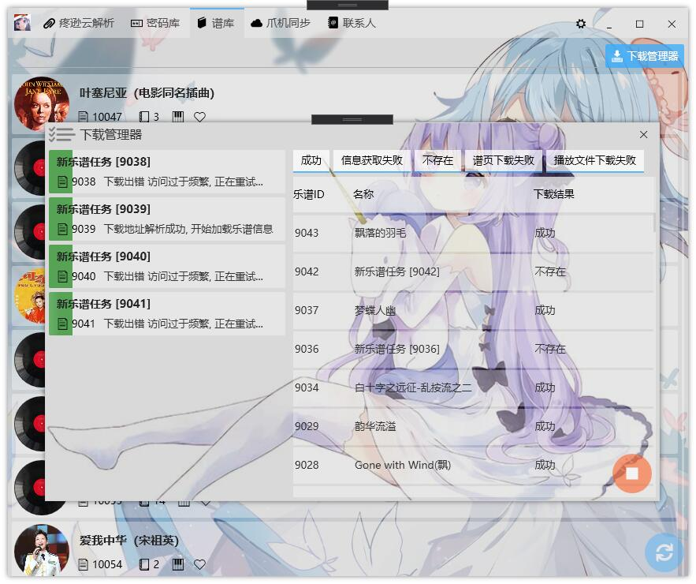

## 基于WPF开发的个人自用Windows平台工具

### 主要功能

***

#### 云解析
> 目前只接入了腾讯云解析, 需要配置访问密钥, 即可管理腾讯云域名
* 新增DNS记录
* 删除DNS记录
* 修改DNS记录
* 查看所有的DNS记录

#### WEB服务
* 计划中...

#### 密码库
> 管理存储于JSON文件的账号密码, 配合Chrome[账号管理插件](https://github.com/Acgnu/Acrx)使用
* 根据域名/备注/站点名称搜索账号
* 新增账号
* 修改账号
* 删除账号

#### 谱库
> 管理所有下载的乐谱
* 下载新乐谱
* 修改乐谱名称
* 调用播放器播放乐谱
* 导出乐谱为分享包
* 查看乐谱下载历史记录
* 删除乐谱

#### 爪机同步
* 计划中...

#### 设置
* 配置账号JSON文件路径
* 配置SQLite文件路径
* 乐谱存储路径
* 代理抓取设置

### 预览

---

