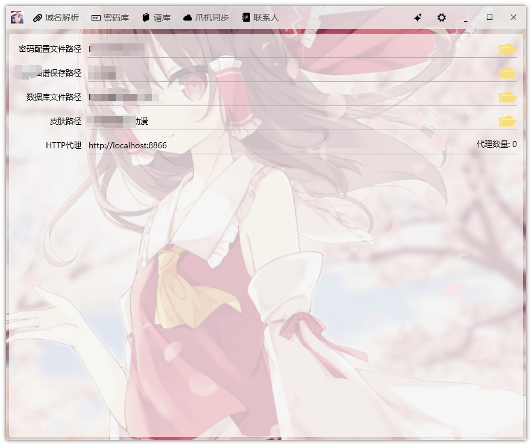

## 基于WPF开发的个人自用Windows平台工具

### 主要功能

 
#### 云解析
> 阿里云 DNS解析记录CURD

#### 密码库
> 管理存储于JSON文件的账号密码, 配合Chrome[账号管理插件](https://github.com/Acgnu/Acrx)使用 

#### 谱库
> 管理所有下载的乐谱
* 显示所有已下载的乐谱, 搜索框默认模糊搜索, 即%关键字%, 输入s:关键字则搜索关键字开头, e:关键字则搜索关键字结尾, f:关键字则搜索完整的关键字, 如果输入为数字, 则按照ID精确搜索
* 点击`下载管理器`, 可查看下载历史, 添加新的下载, 点击浮动的"+"按钮可弹出新建下载弹窗, 输入乐谱ID或者不输入ID勾选`自动下载`, 即可开始下载新的乐谱, 自动下载将按照ID递增下载, 下载历史可通过`Delete`键删除
* 可通过右键下载历史, 选择从当前乐谱ID开始自动自增ID下载
* 单击乐谱标题可修改名称
* 内嵌Flash和Exe双版本的乐谱播放器, 通过列表左侧乐谱图标可点击播放乐谱
* 乐谱归档, 去水印并压缩成zip包, 用于分享
* 右键列表可删除乐谱, 将连带文件夹和数据库一起物理删除

#### 手机同步
> 合并PC端和移动端指定文件夹下的文件
* 监听USB连接和断开, 设备连接和断开都会触发设备文件搜索事件
* 当发现设备连接后, 列出指定文件夹下的差异文件 (仅存于一端的文件), 并显示缩略图
* 按`Delete`键可物理删除对应设备上的文件
* 鼠标左键点击文件项可在状态栏显示文件完整路径和名称
* 鼠标右键点击文件项可在列表中删除此此项, 同步时将跳过该文件
* 鼠标左键双击可调用默认程序打开该文件, 如果文件存在于移动端, 需要先拷贝
* 点击设置悬浮按钮, 可配置两端文件列表
* 点击`同步`按钮可开始同步, 复制PC端文件到移动端, 复制移动端文件到PC端
* 当发现不支持的文件项将发送Windows10通知, 可根据提示人工处理

#### 联系人
* 可保存常用联系人的联系ID, 目前支持微信/QQ 主要用于万一某天号没了, 可找到以前重要联系人
* 默认打开处于安全模式, 在 输入框中输入 `turn off safe mode` 可关闭安全模式, 显示所有联系人

### 预览

---

### 已知问题
*  下载管理在停止任务时可能无法停止全部任务, 推测是时机问题, 问题不大暂不解决
*  关闭子窗口时偶尔会导致主窗口隐藏, 暂时不知道什么原因