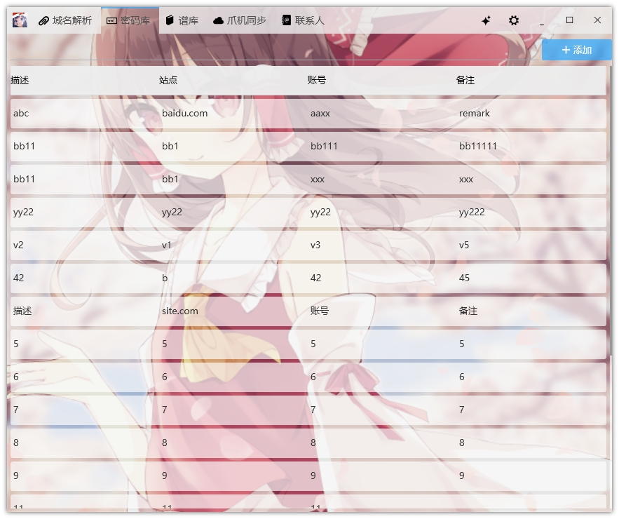
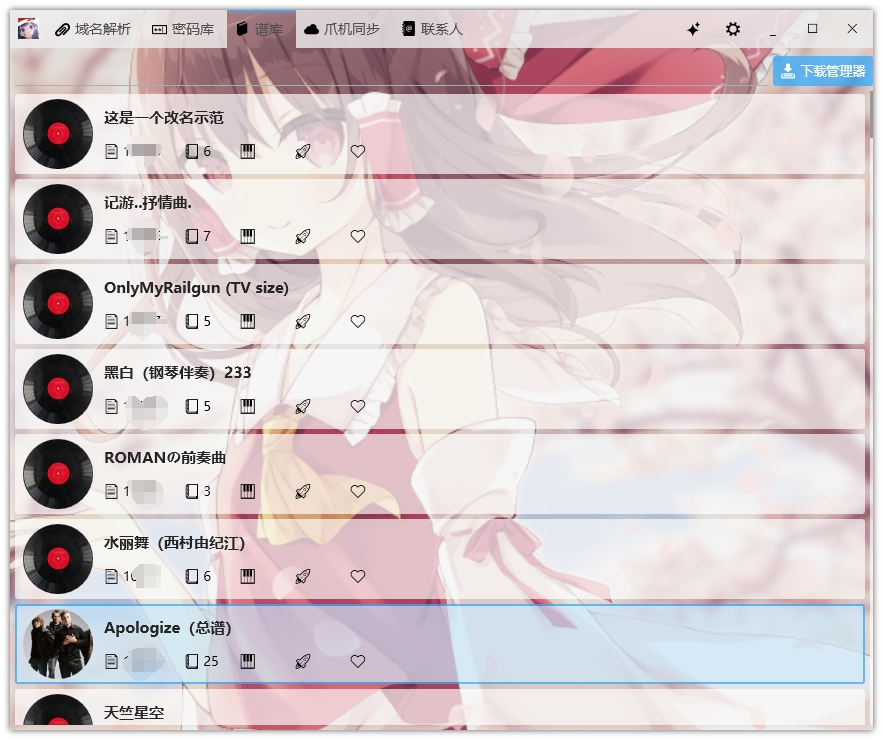
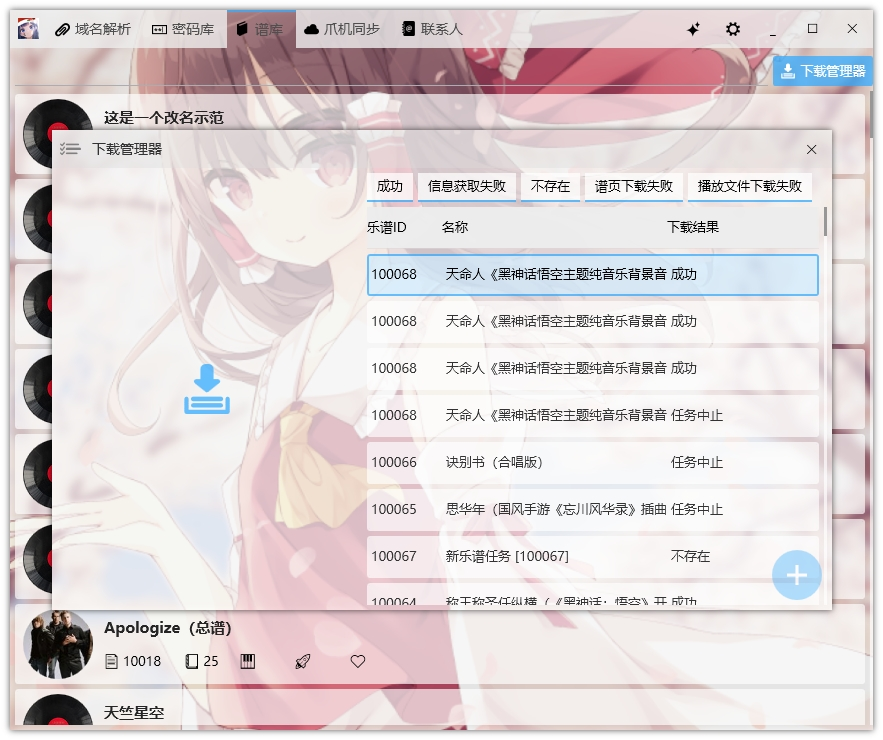

## 基于WPF开发的个人自用Windows平台工具

### 主要功能

***
#### 主界面
 * 右键底部状态栏文本可将文本复制到剪贴板
 
#### 云解析
> 目前只接入了腾讯云解析, 需要配置访问密钥, 即可管理腾讯云域名
* 新增DNS记录
* 删除DNS记录
* 修改DNS记录
* 查看所有的DNS记录

#### WEB服务
* 计划中...

#### 密码库
> 管理存储于JSON文件的账号密码, 配合Chrome[账号管理插件](https://github.com/Acgnu/Acrx)使用
* 根据域名/备注/站点名称搜索账号
* 点击`新增`按钮可新增账号
* 双击项目可打开修改账号对话框
* 右键项目可在展开的菜单中删除账号
* 右键项目可选择复制账号/密码

#### 谱库
> 管理所有下载的乐谱
* 显示所有已下载的乐谱, 搜索框默认模糊搜索, 即%关键字%, 输入s:关键字则搜索关键字开头, e:关键字则搜索关键字结尾, f:关键字则搜索完整的关键字, 如果输入为数字, 则按照ID精确搜索
* 点击`新增`, 输入乐谱ID或者不输入ID勾选`自动下载`, 即可开始下载新的乐谱, 自动下载将按照ID递增下载
* 双击项目可修改乐谱名称
* 内嵌Flash和Exe双版本的乐谱播放器, 通过列表左侧乐谱图标可点击播放乐谱
* 右键可将乐谱归档, 去水印并压缩成zip包, 用于分享
* 点击右下角下载历史, 可打开下载历史窗口, 选中后可按`Delete`键删除历史
* 可通过右键下载历史, 选择从当前乐谱ID开始自动自增ID下载
* 右键列表可删除乐谱, 将连带文件夹和数据库一起物理删除

#### 爪机同步
> 合并PC端和移动端指定文件夹下的文件
* 监听USB连接和断开, 设备连接和断开都会触发设备文件搜索事件
* 当发现设备连接后, 列出指定文件夹下的差异文件 (仅存于一端的文件), 并显示缩略图
* 按`Delete`键可物理删除对应设备上的文件
* 鼠标左键点击文件项可在状态栏显示文件完整路径和名称
* 鼠标右键点击文件项可在列表中删除此此项, 同步时将跳过该文件
* 鼠标左键双击可调用默认程序打开该文件, 如果文件存在于移动端, 需要先拷贝
* 点击`同步`按钮可开始同步, 复制PC端文件到移动端, 复制移动端文件到PC端
* 当发现不支持的文件项将发送Windows10通知, 可根据提示人工处理

#### 设置
* 配置账号JSON文件路径
* 配置软件SQLite主数据库文件路径
* 配置乐谱存储路径, 乐谱将下载于此
* 配置代理抓取页数和站点, 可通过自动安装的IP抓取服务定时抓取网络上的匿名IP, 用作爬虫的代理IP
* 配置同步文件夹映射, 用于两端设备文件的同步

### 预览

---

